## Descripción de los code smells detectados y los patrones aplicados
1. uso repetido de println para mostrar el menu y submenu - Patron de refactorizacion: Reemplazar código repetitivo con estructura de datos
   1. Antes de refactorizar
   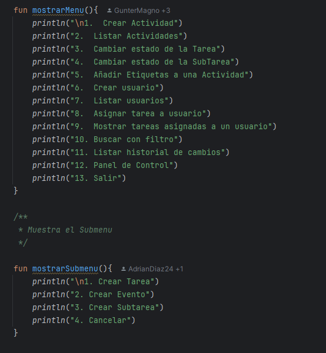
   2. Despues de refactorizar
   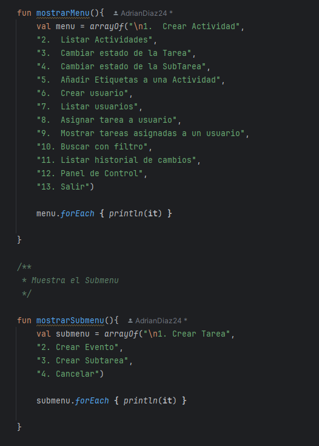
2. Uso de un contador manual en listar actividades, mejor usar forEachIdexed - Patron de refactorizacion: Simplificar condicional
    1. Antes de refactorizar
   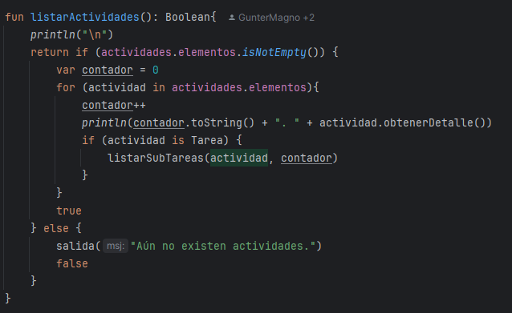
    2. Despues de refactorizar
   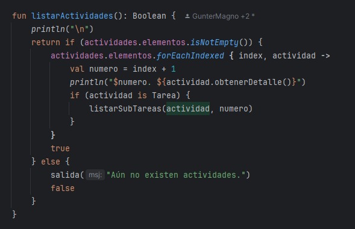
3. Validacion complicada en pedirNum, intentar simplificarla - Patron de refactorizacion: Simplificar condicional
    1. Antes de refactorizar
   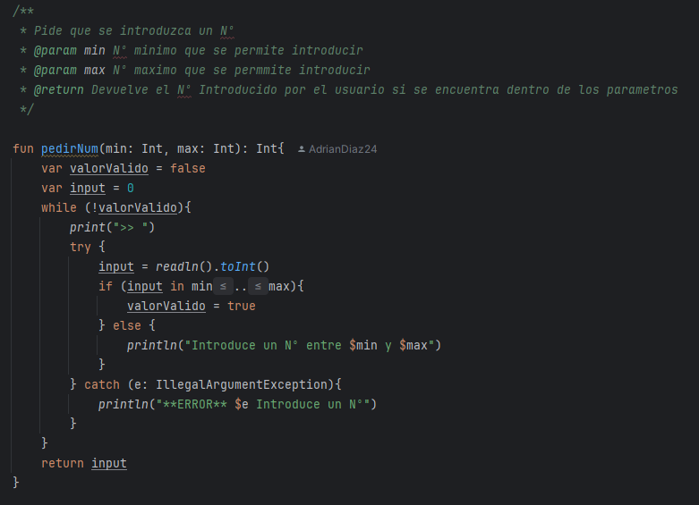
    2. Despues de refactorizar
   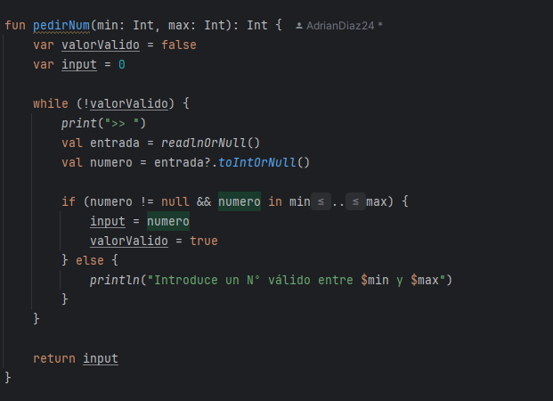
4. listarActividades nno cumple el principio de responsabilidad unica, dividir las funcionalidades para que se cumpla el principio - Patron de refactorizacion: Extraccion de metodo
    1. Antes de refactorizar
   2. 
    2. Despues de refactorizar
   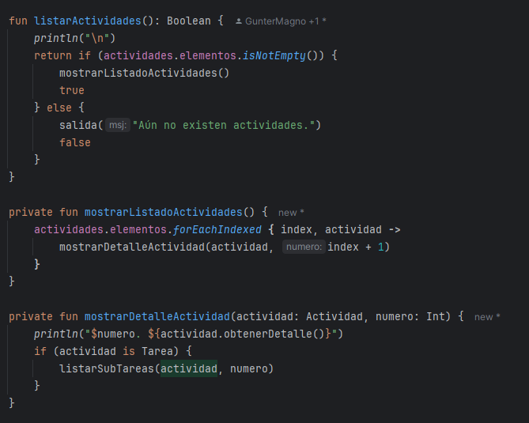
5. Uso de numeros magicos en pedirNum de la funcion menu y submenu, cambiarlo por costantes en un companion object - Patron de refactorizacion: Reemplazar Nº magicos
    1. Antes de refactorizar
   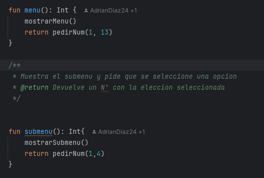
    2. Despues de refactorizar
       1. Coompanion Object
       
       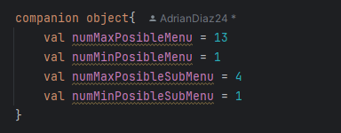
       2. Funciones
       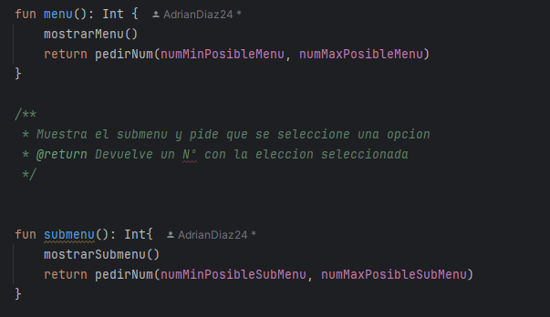

## Lista de pruebas unitarias

1. Clase: Consola - Metodo: pedirNum() detro de menu()
2. Clase: Consola - Metodo: listarActividades() con lista vacia
3. Clase: Consola - Metodo: Clase: Consola - Metodo: listarActividades() con alguna actividad en la lista

Pruebas unitarias antes de refactorizar

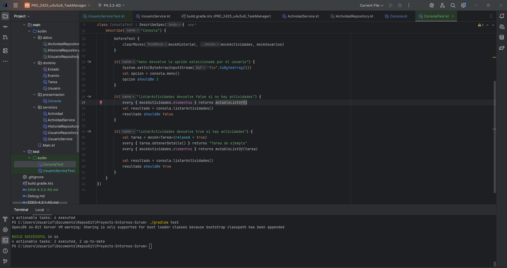

Pruebas unitarias déspues de refactorizar

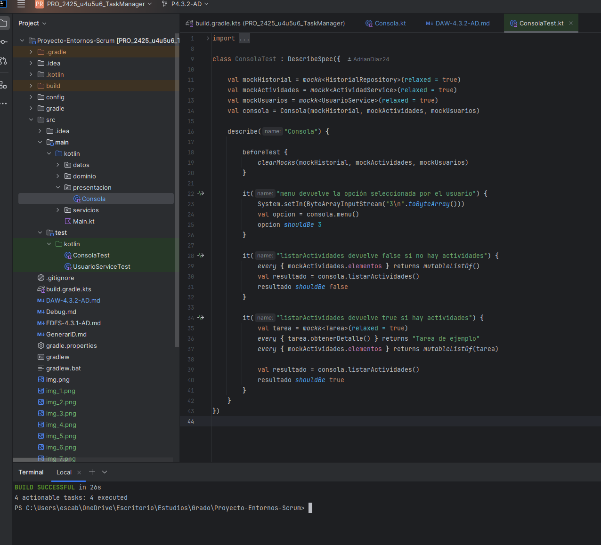

Como se puede ver no ha hecho falta cambiar las pruebas unitarias, y el resultado sigue siendo casi el mismo en esta las 4 fueron ejecutadas satisfactoriamente y en la de antes solo 2 y las otras 2 no se ejecutaron ya que no cambiaron desde la ultima prueba

## Respuestas a las preguntas

## [1]

### 1.a ¿Qué code smell y patrones de refactorización has aplicado?

- He detectado repetición de código al usar muchos `println` seguidos para mostrar menús y submenús, por lo que lo he reemplazado con un array y un bucle `forEach` que recorre todos los strings y los muestra por pantalla.
- En la función `listarActividades`, se usaba un contador manual para numerar los elementos. Lo he sustituido por `forEachIndexed` para que sea más claro y evite contar manualmente.
- En la función `pedirNum`, la validación de entrada estaba escrita de forma compleja con el try catch, por lo que lo he simplificado quitando este y con un if se compruebe que sea un Nº y este dentro de los valores definidos.
- La función `listarActividades` no cumplia el principio de responsabilidad unica, por lo que se dividio en varias funciones para intentar cumplirlo.
- También se usaban Nº mágicos (Nº puestos a mano en vez de estar almacenados en un `val`), que he sustituido por constantes en un `companion object` para evitar el uso de Nº magicos y sea facil de cambiar si fuera necesario en un futuro.

Los patrones de refactorización aplicados son:

- Reemplazar código repetitivo con estructura de datos
- Simplificar condicional
- Extracción de método
- Reemplazar números mágicos

---

### 1.b Teniendo en cuenta aquella funcionalidad que tiene pruebas unitarias, selecciona un patrón de refactorización de los que has aplicado y que están cubierto por los test unitarios. ¿Por qué mejora o no mejora tu código? Asegúrate de poner enlaces a tu código

El patrón de **extracción de método** aplicado en la función `listarActividades`.

Este patrón mejora el código porque:

- Separa responsabilidades en funciones más pequeñas, haciendo el código más limpio y fácil de entender.
- Facilita el mantenimiento en el futuro.
- Permite hacer pruebas unitarias más específicas y centradas.

```kotlin
private fun mostrarListadoActividades() {
        actividades.elementos.forEachIndexed { index, actividad ->
            mostrarDetalleActividad(actividad, index + 1)
        }
    }

    private fun mostrarDetalleActividad(actividad: Actividad, numero: Int) {
        println("$numero. ${actividad.obtenerDetalle()}")
        if (actividad is Tarea) {
            listarSubTareas(actividad, numero)
        }
    }

    fun listarSubTareas(tarea: Tarea, contador: Int){
        if (tarea.listaSubtareas.isNotEmpty()){
            var contador1 = 0
            for (subtarea in tarea.listaSubtareas){
                contador1++
                println("\t$contador.${contador1}. ${subtarea.obtenerDetalle()}")
            }
        }
    }
```

---

## [2]

### 2.a Describe el proceso que sigues para asegurarte que la refactorización no afecta a código que ya tenías desarrollado.

Para asegurarme de que la refactorización no rompe nada del código que ya funcionaba:

1. Ejecuto todas las pruebas unitarias antes de hacer cambios, para asegurarme de que el estado inicial es correcto.
2. Pienso como podria cambiar el codigo para que sea mejor pero siga funcionando igual y tras ello lo intento refactorizar
3. Después de refactorizarlo ejecuto la prueba unitaria para comprobar que sigue funcionado.
4. Y por ultimo ejecuto el programa y pruebo todas las posibilidades que tuviera esa funcion para asegurarme que no cambia el funcionamiento general.

---

## [3]

### 3.a ¿Qué funcionalidad del IDE has usado para aplicar la refactorización seleccionada? Si es necesario, añade capturas de pantalla para identificar la funcionalidad.

- La opción **Refactor > Refactor This...**.

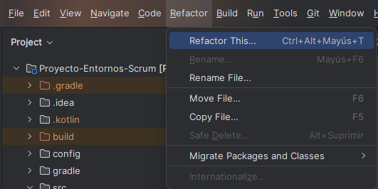

- El uso del atajo `Alt + Enter` para aplicar sugerencias de simplificación de código.

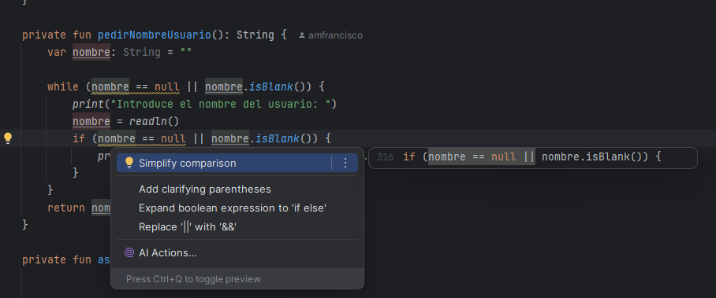

- El sistema de detección de advertencias de IntelliJ para ver dónde había código mejorable.

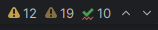


