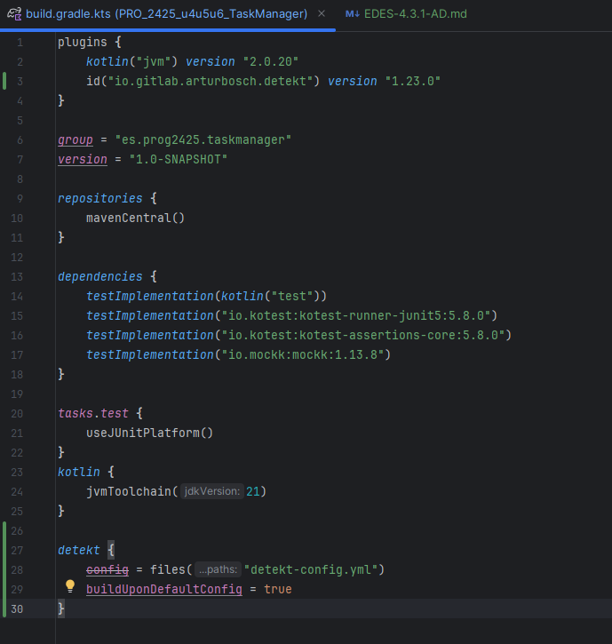

## Descripcion de la Actividad

La actividad consiste en instalar y usar un analizador de código estático (Detekt o Ktlint) en el proyecto que vienes desarrollando, capturar evidencias gráficas, detectar y clasificar errores, aplicar soluciones y explorar las posibilidades de configuración de la herramienta elegida.

Instala y usa los analizadores de código comentados en clase: Detekt, Ktlint

### Objetivo:

- Conocer que es Analizador de código y su proposito
- Familiarizarse con herramientas Detekt o Ktlint.
- Usar las herramientas y estudiar y aplicar configuraciones de la herramienta seleccionada.

### Trabajo a realizar:

Haciendo uso de las herramientas descritas en el punto 4.3 Analizador de código

- Instalar la herramienta elegida (Detekt o Ktlint) e incluir capturas de pantalla del proceso.
- Integrar el analizador en el proyecto que se está desarrollando y ejecutar el análisis.
- Identificar al menos 5 tipos de errores detectados.
- Para cada tipo de error, documentar:
  - Descripción del error.
  - Solución aplicada (antes y después, con enlaces a commits específicos).
- Explorar y modificar al menos una opción de configuración del analizador distinta de la predeterminada; describir cómo afecta al código y por tanto al informe de errores.

## Capturas, lista de errores, soluciones, configuraciones, respuestas a las preguntas y conclusiones.

### Instalar Detekt



Para instalar Detekt hay que añadir al Build.Gradle en la zona de los plugins lo de id 'io.gitlab.arturbosch.detekt' version '1.23.0' y añadir una nueva zona llamada detekt que contenga lo siguiente buildUponDefaultConfig = true y se ejecuta con ./gradlew detekt.

El proyecto esta realizado con la JDK 21 y Detekt solo reconoce hasta la 19 por eso le forzamos con el siguiente comando en e Build.Gradle que para esto use la JDK 17 y serie este: 

``` kts
tasks.withType<io.gitlab.arturbosch.detekt.Detekt>().configureEach {
  jvmTarget = "17"
}
```
### Lista de errores

1. Proyecto-Entornos-Scrum\src\main\kotlin\datos\IHistorialRepository.kt:9:9: Function names should match the pattern: [a-z][a-zA-Z0-9]* [FunctionNaming]

- Este error se debe a que la funcion no esta escrita con lowerCamelCase
- Cambiar el nombre de la funcion a lowerCamelCase

2. Proyecto-Entornos-Scrum\src\main\kotlin\datos\IActividadRepository.kt:18:2: The file C:\Users\escab\OneDrive\Escritorio\Estudios\Grado\Proyecto-Entornos-Scrum\src\main\kotlin\datos\IActividadRepository.kt is not ending with a new line. [NewLineAtEndOfFile] 

- Este error se debe al no haber dejado una linea en blanco al final del archivo
- Se añaden la linea en blanco en todos los archivos donde ha saltado este error

3. Proyecto-Entornos-Scrum\src\main\kotlin\presentacion\Consola.kt:5:1: es.prog2425.taskmanager.dominio.* is a wildcard import. Replace it with fully qualified imports. [WildcardImport]

- Este error salta al hacer un import con un * como por ejemplo en este caso es.prog2425.taskmanager.dominio.*
- Se cambiara el import para que solo importe las clases usadas

4. Proyecto-Entornos-Scrum\src\main\kotlin\presentacion\Consola.kt:100:22: The caught exception is swallowed. The original exception could be lost. [SwallowedException]

- Este error sale ya que no se maneja adecuadamente una execepcion
- Cambiar la funcion para que al menos muestre el error que se produce

5. Proyecto-Entornos-Scrum\src\main\kotlin\datos\IActividadRepository.kt:1:1: The package declaration does not match the actual file location. [InvalidPackageDeclaration]

- El error dice que el package esta mal puesto segun la ubicacion del archivo
- Ya esta solucionado es un falso positivo ya que el package del Main.kt es package es.prog2425.taskmanager y la de IActividadRepository es package es.prog2425.taskmanager.datos que es la carpeta (datos) que se encuentra 

## Cambiar la configuracion

Para cambiar la configuracion de Detekt primero hay que crear el archivo de la configuracion eso se hace con "./gradlew detektGenerateConfig" una vez ejecutado este comando se crea una carpeta config y dentro de esta la de detekt.yml donde esta la configuracion predeterminada.

La configuracion que he cambiado ha sido la del error de FunctionNaming que saltaba cuando una funcion no se escribia con lowerCamelCase para que siga funcionando igual pero añadiendo la Ñ para que no salte el error al escribir funciones en español

Antes: 
``` yml
FunctionNaming:
active: true
excludes: ['**/test/**', '**/androidTest/**', '**/commonTest/**', '**/jvmTest/**', '**/androidUnitTest/**', '**/androidInstrumentedTest/**', '**/jsTest/**', '**/iosTest/**']
functionPattern: '[a-z][a-zA-Z0-9]*'
excludeClassPattern: '$^'
```
Despues:
``` yml
FunctionNaming:
active: true
excludes: ['**/test/**', '**/androidTest/**', '**/commonTest/**', '**/jvmTest/**', '**/androidUnitTest/**', '**/androidInstrumentedTest/**', '**/jsTest/**', '**/iosTest/**']
functionPattern: '[a-zñ][a-zA-Z0-9ñ]*'
excludeClassPattern: '$^'
```

Recordar añadir al Build.Gradle en la parte de Detekt la linea de codigo con lo siguiente "config.from(files("config/detekt/detekt.yml"))" cambiando lo de dentro de files por la ruta a la configuracion

###  respuestas a las preguntas y conclusiones.

- 1
  - 1.a ¿Que herramienta has usado y para que sirve?
    - He uasdo Detekt que es un analizador de codigo estatico y sirve para analizar un codigo y detectar posibles errores, malas practicas, entres otros posibles errores
  - 1.b ¿Cuales son sus características principales?
    - Analiza el codigo sin compilarlo
    - Detecta problemas como funciones muy largas y otras malas practicas
    - Puede usar una configuracion personalizada
    - Se puede implementar desde el Build.Gradle.kts
  - 1.c ¿Qué beneficios obtengo al utilizar dicha herramienta?
    - Mejora la calidad del codigo
    - Evitar esos errores a futuro 
    - Ahorra tiempo comparado con la revision manual
- 2
  - 2.a De los errores/problemas que la herramienta ha detectado y te ha ayudado a solucionar, ¿cual es el que te ha parecido que ha mejorado más tu código?
    - El de SwallowedException ya que asi controlo mejor el error y lo se para la siguiente
  - 2.b ¿La solución que se le ha dado al error/problema la has entendido y te ha parecido correcta?
    - Si
  - 2.c ¿Por qué se ha producido ese error/problema?
    - Porque tenia un try catch que realizaba un print pero este no mostraba el error
- 3
  - 3.a ¿Que posibilidades de configuración tiene la herramienta?
    - Puedes configurar todos los errores que te saltan
  - 3.b De esas posibilidades de configuración, ¿cuál has configurado para que sea distinta a la que viene por defecto?
    - Añadir a la expresion regular la Ñ para que no salte el error con nombre en español
  - 3.c Pon un ejemplo de como ha impactado en tu código, enlazando al código anterior al cambio, y al posterior al cambio,
    - No ha impactado mucho excepto que antes saltaba error con las funciones añadirX y ya no
- 4
  - 4 ¿Qué conclusiones sacas después del uso de estas herramientas?
    - Es una herramienta util para controlar el tamaño de funciones y su complejidad sin tener que revisarlo manualmente, tambien te puede ayudar con posbles errores en nombre de funciones o varibles entre otras cosas, principalmente te permite revisar posibles errores rapidamente sin tener que mirar todo el codigo

## Enlaces a commits relevantes

1. FunctionNaming
- Antes: https://github.com/AdrianDiaz24/Proyecto-Entornos-Scrum/blob/78b18f0d9a5ccf4fe05ae550b0e892332dc8be21/src/main/kotlin/datos/IHistorialRepository.kt
- Despues: https://github.com/AdrianDiaz24/Proyecto-Entornos-Scrum/blob/ac958edc04c91cc1342e99c6e7d5f7be7f524cbb/src/main/kotlin/datos/IHistorialRepository.kt 
2. NewLineAtEndOfFile
- Antes: https://github.com/AdrianDiaz24/Proyecto-Entornos-Scrum/blob/78b18f0d9a5ccf4fe05ae550b0e892332dc8be21/src/main/kotlin/datos/IActividadRepository.kt
- Despues: https://github.com/AdrianDiaz24/Proyecto-Entornos-Scrum/blob/8f99b57a1d2c6610c49b933dc802fe457a95dc5f/src/main/kotlin/datos/IActividadRepository.kt
3. WildcardImport
- Antes: https://github.com/AdrianDiaz24/Proyecto-Entornos-Scrum/blob/78b18f0d9a5ccf4fe05ae550b0e892332dc8be21/src/main/kotlin/presentacion/Consola.kt
- Despues: https://github.com/AdrianDiaz24/Proyecto-Entornos-Scrum/blob/81c01000e4d0d5b273c558232a7cf53b402a5fa8/src/main/kotlin/presentacion/Consola.kt
4. SwallowedException
- Antes: https://github.com/AdrianDiaz24/Proyecto-Entornos-Scrum/blob/78b18f0d9a5ccf4fe05ae550b0e892332dc8be21/src/main/kotlin/presentacion/Consola.kt
- Despues: https://github.com/AdrianDiaz24/Proyecto-Entornos-Scrum/blob/ad6706ba455c9708a9e597ec51b68faf092174f7/src/main/kotlin/presentacion/Consola.kt
5. InvalidPackageDeclaration
- Antes: https://github.com/AdrianDiaz24/Proyecto-Entornos-Scrum/blob/78b18f0d9a5ccf4fe05ae550b0e892332dc8be21/src/main/kotlin/datos/IActividadRepository.kt
- Despues: https://github.com/AdrianDiaz24/Proyecto-Entornos-Scrum/blob/943bb125759f5ccb32133146bea9b1a779438efc/src/main/kotlin/datos/IActividadRepository.kt