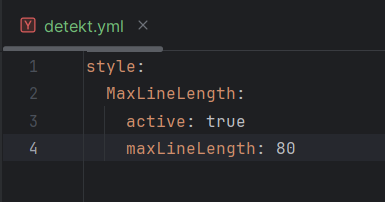
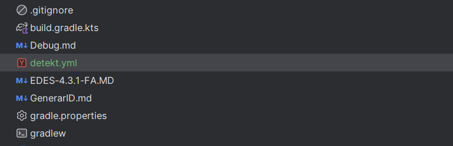

# EDES-4.3.1 - Análisis Estático de Código con Detekt y Ktlint

## Descripción de la Actividad

Esta actividad consiste en instalar y usar un analizador de código estático en el proyecto actual (Detekt o Ktlint), capturar evidencias gráficas, detectar y clasificar errores, aplicar soluciones y explorar configuraciones.

---

## Paso 1: Instalación del Analizador de Código

### Herramienta Elegida: Detekt y Ktlint

Ambas herramientas se han integrado en el proyecto para ampliar el análisis estático y la limpieza del código.

### Instalación

Para instalar ambos analizadores de código, añadí los plugins correspondientes en el archivo `build.gradle.kts`. Esto permite integrarlos de forma automática en el flujo de trabajo de Gradle.

**build.gradle.kts:**

```kotlin
plugins {
    kotlin("jvm") version "2.0.20"
    id("io.gitlab.arturbosch.detekt") version "1.23.0"
    id("org.jlleitschuh.gradle.ktlint") version "12.1.0"
}

kotlin {
    jvmToolchain(17)
}
```

### Capturas realizadas:

**build.gradle.kts con plugins añadidos:**


**terminal con instalación y sincronización exitosa de Gradle:**


**estructura del proyecto:**


---

## Paso 2: Integración y Ejecución del Análisis

### Ejecución

Desde la terminal del proyecto se han ejecutado los comandos:

```bash
./gradlew detekt
./gradlew ktlintCheck
```

### Detekt

Se detectaron **85 problemas ponderados** que indican errores y malas prácticas.

Incluye problemas de complejidad, nombres incorrectos, funciones largas, imports no usados, falta de documentación y uso de números mágicos.

Es importante revisar el informe generado para corregirlos y mejorar la calidad del código.

```bash
PS C:\Users\Fran\Documents\ReposGit\Proyecto-Entornos-Scrum> ./gradlew detekt

> Task :detekt FAILED
C:\Users\Fran\Documents\ReposGit\Proyecto-Entornos-Scrum\src\main\kotlin\presentacion\Consola.kt:450:17: The function buscarFiltro is too long (118). The maximum length is 60. [LongMethod]
C:\Users\Fran\Documents\ReposGit\Proyecto-Entornos-Scrum\src\main\kotlin\presentacion\Consola.kt:208:9: The function ejecutarPrograma appears to be too complex based on Cyclomatic Complexity (complexity: 15). Defined complexity threshold for methods is set to '15' [CyclomaticComplexMethod]
C:\Users\Fran\Documents\ReposGit\Proyecto-Entornos-Scrum\src\main\kotlin\presentacion\Consola.kt:450:17: The function buscarFiltro appears to be too complex based on Cyclomatic Complexity (complexity: 49). Defined complexity threshold for methods is set to '15' [CyclomaticComplexMethod]
C:\Users\Fran\Documents\ReposGit\Proyecto-Entornos-Scrum\src\main\kotlin\presentacion\Consola.kt:134:9: Function crearActividad is nested too deeply. [NestedBlockDepth]
C:\Users\Fran\Documents\ReposGit\Proyecto-Entornos-Scrum\src\main\kotlin\presentacion\Consola.kt:335:17: Function cambiarEstado is nested too deeply. [NestedBlockDepth]
C:\Users\Fran\Documents\ReposGit\Proyecto-Entornos-Scrum\src\main\kotlin\presentacion\Consola.kt:380:17: Function cambiarEstadoSubTarea is nested too deeply. [NestedBlockDepth]
C:\Users\Fran\Documents\ReposGit\Proyecto-Entornos-Scrum\src\main\kotlin\presentacion\Consola.kt:450:17: Function buscarFiltro is nested too deeply. [NestedBlockDepth]
C:\Users\Fran\Documents\ReposGit\Proyecto-Entornos-Scrum\src\main\kotlin\presentacion\Consola.kt:598:17: Function mostrarEstadisticasTareas is nested too deeply. [NestedBlockDepth]
C:\Users\Fran\Documents\ReposGit\Proyecto-Entornos-Scrum\src\main\kotlin\presentacion\Consola.kt:9:7: Class 'Consola' with '24' functions detected. Defined threshold inside classes is set to '11' [TooManyFunctions]
C:\Users\Fran\Documents\ReposGit\Proyecto-Entornos-Scrum\src\main\kotlin\presentacion\Consola.kt:100:22: The caught exception is swallowed. The original exception could be lost. [SwallowedException]
C:\Users\Fran\Documents\ReposGit\Proyecto-Entornos-Scrum\src\main\kotlin\datos\IActividadRepository.kt:1:1: The package declaration does not match the actual file location. [InvalidPackageDeclaration]
C:\Users\Fran\Documents\ReposGit\Proyecto-Entornos-Scrum\src\main\kotlin\datos\IHistorialRepository.kt:1:1: The package declaration does not match the actual file location. [InvalidPackageDeclaration]
C:\Users\Fran\Documents\ReposGit\Proyecto-Entornos-Scrum\src\main\kotlin\datos\IHistorialRepository.kt:9:9: Function names should match the pattern: [a-z][a-zA-Z0-9]* [FunctionNaming]
C:\Users\Fran\Documents\ReposGit\Proyecto-Entornos-Scrum\src\main\kotlin\datos\IHistorialRepository.kt:10:9: Function names should match the pattern: [a-z][a-zA-Z0-9]* [FunctionNaming]
C:\Users\Fran\Documents\ReposGit\Proyecto-Entornos-Scrum\src\main\kotlin\datos\IUsuarioRepository.kt:1:1: The package declaration does not match the actual file location. [InvalidPackageDeclaration]
C:\Users\Fran\Documents\ReposGit\Proyecto-Entornos-Scrum\src\main\kotlin\dominio\Estado.kt:1:1: The package declaration does not match the actual file location. [InvalidPackageDeclaration]
C:\Users\Fran\Documents\ReposGit\Proyecto-Entornos-Scrum\src\main\kotlin\dominio\Evento.kt:1:1: The package declaration does not match the actual file location. [InvalidPackageDeclaration]
C:\Users\Fran\Documents\ReposGit\Proyecto-Entornos-Scrum\src\main\kotlin\dominio\Tarea.kt:1:1: The package declaration does not match the actual file location. [InvalidPackageDeclaration]
C:\Users\Fran\Documents\ReposGit\Proyecto-Entornos-Scrum\src\main\kotlin\dominio\Usuario.kt:1:1: The package declaration does not match the actual file location. [InvalidPackageDeclaration]
C:\Users\Fran\Documents\ReposGit\Proyecto-Entornos-Scrum\src\main\kotlin\Main.kt:1:1: The package declaration does not match the actual file location. [InvalidPackageDeclaration]
C:\Users\Fran\Documents\ReposGit\Proyecto-Entornos-Scrum\src\main\kotlin\presentacion\Consola.kt:1:1: The package declaration does not match the actual file location. [InvalidPackageDeclaration]
C:\Users\Fran\Documents\ReposGit\Proyecto-Entornos-Scrum\src\main\kotlin\presentacion\Consola.kt:654:13: Variable names should match the pattern: [a-z][A-Za-z0-9]* [VariableNaming]
C:\Users\Fran\Documents\ReposGit\Proyecto-Entornos-Scrum\src\main\kotlin\presentacion\Consola.kt:659:13: Variable names should match the pattern: [a-z][A-Za-z0-9]* [VariableNaming]
C:\Users\Fran\Documents\ReposGit\Proyecto-Entornos-Scrum\src\main\kotlin\servicios\Actividad.kt:1:1: The package declaration does not match the actual file location. [InvalidPackageDeclaration]
C:\Users\Fran\Documents\ReposGit\Proyecto-Entornos-Scrum\src\main\kotlin\servicios\Actividad.kt:1:1: Package name should match the pattern: [a-z]+(\.[a-z][A-Za-z0-9]*)* [PackageNaming]
C:\Users\Fran\Documents\ReposGit\Proyecto-Entornos-Scrum\src\main\kotlin\servicios\ActividadService.kt:1:1: The package declaration does not match the actual file location. [InvalidPackageDeclaration]
C:\Users\Fran\Documents\ReposGit\Proyecto-Entornos-Scrum\src\main\kotlin\servicios\HistorialRepository.kt:1:1: The package declaration does not match the actual file location. [InvalidPackageDeclaration]
C:\Users\Fran\Documents\ReposGit\Proyecto-Entornos-Scrum\src\main\kotlin\servicios\UsuarioRepository.kt:1:1: The package declaration does not match the actual file location. [InvalidPackageDeclaration]
C:\Users\Fran\Documents\ReposGit\Proyecto-Entornos-Scrum\src\main\kotlin\servicios\UsuarioService.kt:1:1: The package declaration does not match the actual file location. [InvalidPackageDeclaration]
C:\Users\Fran\Documents\ReposGit\Proyecto-Entornos-Scrum\src\main\kotlin\datos\IActividadRepository.kt:18:2: The file C:\Users\Fran\Documents\ReposGit\Proyecto-Entornos-Scrum\src\main\kotlin\datos\IActividadRepository.kt is not ending with a new line. [NewLineAtEndOfFile]
C:\Users\Fran\Documents\ReposGit\Proyecto-Entornos-Scrum\src\main\kotlin\datos\IHistorialRepository.kt:12:2: The file C:\Users\Fran\Documents\ReposGit\Proyecto-Entornos-Scrum\src\main\kotlin\datos\IHistorialRepository.kt is not ending with a new line. [NewLineAtEndOfFile]
C:\Users\Fran\Documents\ReposGit\Proyecto-Entornos-Scrum\src\main\kotlin\datos\IUsuarioRepository.kt:12:2: The file C:\Users\Fran\Documents\ReposGit\Proyecto-Entornos-Scrum\src\main\kotlin\datos\IUsuarioRepository.kt is not ending with a new line. [NewLineAtEndOfFile]
C:\Users\Fran\Documents\ReposGit\Proyecto-Entornos-Scrum\src\main\kotlin\dominio\Estado.kt:11:2: The file C:\Users\Fran\Documents\ReposGit\Proyecto-Entornos-Scrum\src\main\kotlin\dominio\Estado.kt is not ending with a new line. [NewLineAtEndOfFile]
C:\Users\Fran\Documents\ReposGit\Proyecto-Entornos-Scrum\src\main\kotlin\dominio\Evento.kt:39:2: The file C:\Users\Fran\Documents\ReposGit\Proyecto-Entornos-Scrum\src\main\kotlin\dominio\Evento.kt is not ending with a new line. [NewLineAtEndOfFile]
C:\Users\Fran\Documents\ReposGit\Proyecto-Entornos-Scrum\src\main\kotlin\dominio\Evento.kt:8:1: Line detected, which is longer than the defined maximum line length in the code style. [MaxLineLength]
C:\Users\Fran\Documents\ReposGit\Proyecto-Entornos-Scrum\src\main\kotlin\dominio\Evento.kt:29:13: patronFecha can be a `const val`. [MayBeConst]
C:\Users\Fran\Documents\ReposGit\Proyecto-Entornos-Scrum\src\main\kotlin\dominio\Tarea.kt:40:2: The file C:\Users\Fran\Documents\ReposGit\Proyecto-Entornos-Scrum\src\main\kotlin\dominio\Tarea.kt is not ending with a new line. [NewLineAtEndOfFile]
C:\Users\Fran\Documents\ReposGit\Proyecto-Entornos-Scrum\src\main\kotlin\dominio\Usuario.kt:19:2: The file C:\Users\Fran\Documents\ReposGit\Proyecto-Entornos-Scrum\src\main\kotlin\dominio\Usuario.kt is not ending with a new line. [NewLineAtEndOfFile]
C:\Users\Fran\Documents\ReposGit\Proyecto-Entornos-Scrum\src\main\kotlin\Main.kt:7:2: The file C:\Users\Fran\Documents\ReposGit\Proyecto-Entornos-Scrum\src\main\kotlin\Main.kt is not ending with a new line. [NewLineAtEndOfFile]
C:\Users\Fran\Documents\ReposGit\Proyecto-Entornos-Scrum\src\main\kotlin\presentacion\Consola.kt:142:17: The destructuring declaration contains 4 but only 3 are allowed. [DestructuringDeclarationWithTooManyEntries]
C:\Users\Fran\Documents\ReposGit\Proyecto-Entornos-Scrum\src\main\kotlin\presentacion\Consola.kt:4:1: es.prog2425.taskmanager.servicios.* is a wildcard import. Replace it with fully qualified imports. [WildcardImport]
C:\Users\Fran\Documents\ReposGit\Proyecto-Entornos-Scrum\src\main\kotlin\presentacion\Consola.kt:5:1: es.prog2425.taskmanager.dominio.* is a wildcard import. Replace it with fully qualified imports. [WildcardImport]
C:\Users\Fran\Documents\ReposGit\Proyecto-Entornos-Scrum\src\main\kotlin\presentacion\Consola.kt:9:1: Line detected, which is longer than the defined maximum line length in the code style. [MaxLineLength]
C:\Users\Fran\Documents\ReposGit\Proyecto-Entornos-Scrum\src\main\kotlin\presentacion\Consola.kt:137:1: Line detected, which is longer than the defined maximum line length in the code style. [MaxLineLength]
C:\Users\Fran\Documents\ReposGit\Proyecto-Entornos-Scrum\src\main\kotlin\presentacion\Consola.kt:158:1: Line detected, which is longer than the defined maximum line length in the code style. [MaxLineLength]
C:\Users\Fran\Documents\ReposGit\Proyecto-Entornos-Scrum\src\main\kotlin\presentacion\Consola.kt:372:1: Line detected, which is longer than the defined maximum line length in the code style. [MaxLineLength]
C:\Users\Fran\Documents\ReposGit\Proyecto-Entornos-Scrum\src\main\kotlin\presentacion\Consola.kt:416:1: Line detected, which is longer than the defined maximum line length in the code style. [MaxLineLength]
C:\Users\Fran\Documents\ReposGit\Proyecto-Entornos-Scrum\src\main\kotlin\presentacion\Consola.kt:420:1: Line detected, which is longer than the defined maximum line length in the code style. [MaxLineLength]
C:\Users\Fran\Documents\ReposGit\Proyecto-Entornos-Scrum\src\main\kotlin\presentacion\Consola.kt:678:1: Line detected, which is longer than the defined maximum line length in the code style. [MaxLineLength]
C:\Users\Fran\Documents\ReposGit\Proyecto-Entornos-Scrum\src\main\kotlin\presentacion\Consola.kt:68:28: This expression contains a magic number. Consider defining it to a well named constant. [MagicNumber]
C:\Users\Fran\Documents\ReposGit\Proyecto-Entornos-Scrum\src\main\kotlin\presentacion\Consola.kt:78:27: This expression contains a magic number. Consider defining it to a well named constant. [MagicNumber]
C:\Users\Fran\Documents\ReposGit\Proyecto-Entornos-Scrum\src\main\kotlin\presentacion\Consola.kt:149:13: This expression contains a magic number. Consider defining it to a well named constant. [MagicNumber]
C:\Users\Fran\Documents\ReposGit\Proyecto-Entornos-Scrum\src\main\kotlin\presentacion\Consola.kt:168:13: This expression contains a magic number. Consider defining it to a well named constant. [MagicNumber]
C:\Users\Fran\Documents\ReposGit\Proyecto-Entornos-Scrum\src\main\kotlin\presentacion\Consola.kt:222:17: This expression contains a magic number. Consider defining it to a well named constant. [MagicNumber]
C:\Users\Fran\Documents\ReposGit\Proyecto-Entornos-Scrum\src\main\kotlin\presentacion\Consola.kt:226:17: This expression contains a magic number. Consider defining it to a well named constant. [MagicNumber]
C:\Users\Fran\Documents\ReposGit\Proyecto-Entornos-Scrum\src\main\kotlin\presentacion\Consola.kt:230:17: This expression contains a magic number. Consider defining it to a well named constant. [MagicNumber]
C:\Users\Fran\Documents\ReposGit\Proyecto-Entornos-Scrum\src\main\kotlin\presentacion\Consola.kt:234:17: This expression contains a magic number. Consider defining it to a well named constant. [MagicNumber]
C:\Users\Fran\Documents\ReposGit\Proyecto-Entornos-Scrum\src\main\kotlin\presentacion\Consola.kt:238:17: This expression contains a magic number. Consider defining it to a well named constant. [MagicNumber]
C:\Users\Fran\Documents\ReposGit\Proyecto-Entornos-Scrum\src\main\kotlin\presentacion\Consola.kt:242:17: This expression contains a magic number. Consider defining it to a well named constant. [MagicNumber]
C:\Users\Fran\Documents\ReposGit\Proyecto-Entornos-Scrum\src\main\kotlin\presentacion\Consola.kt:246:17: This expression contains a magic number. Consider defining it to a well named constant. [MagicNumber]
C:\Users\Fran\Documents\ReposGit\Proyecto-Entornos-Scrum\src\main\kotlin\presentacion\Consola.kt:250:17: This expression contains a magic number. Consider defining it to a well named constant. [MagicNumber]
C:\Users\Fran\Documents\ReposGit\Proyecto-Entornos-Scrum\src\main\kotlin\presentacion\Consola.kt:254:17: This expression contains a magic number. Consider defining it to a well named constant. [MagicNumber]
C:\Users\Fran\Documents\ReposGit\Proyecto-Entornos-Scrum\src\main\kotlin\presentacion\Consola.kt:258:17: This expression contains a magic number. Consider defining it to a well named constant. [MagicNumber]
C:\Users\Fran\Documents\ReposGit\Proyecto-Entornos-Scrum\src\main\kotlin\presentacion\Consola.kt:262:17: This expression contains a magic number. Consider defining it to a well named constant. [MagicNumber]
C:\Users\Fran\Documents\ReposGit\Proyecto-Entornos-Scrum\src\main\kotlin\presentacion\Consola.kt:348:38: This expression contains a magic number. Consider defining it to a well named constant. [MagicNumber]
C:\Users\Fran\Documents\ReposGit\Proyecto-Entornos-Scrum\src\main\kotlin\presentacion\Consola.kt:364:21: This expression contains a magic number. Consider defining it to a well named constant. [MagicNumber]
C:\Users\Fran\Documents\ReposGit\Proyecto-Entornos-Scrum\src\main\kotlin\presentacion\Consola.kt:407:42: This expression contains a magic number. Consider defining it to a well named constant. [MagicNumber]
C:\Users\Fran\Documents\ReposGit\Proyecto-Entornos-Scrum\src\main\kotlin\presentacion\Consola.kt:419:21: This expression contains a magic number. Consider defining it to a well named constant. [MagicNumber]
C:\Users\Fran\Documents\ReposGit\Proyecto-Entornos-Scrum\src\main\kotlin\presentacion\Consola.kt:454:41: This expression contains a magic number. Consider defining it to a well named constant. [MagicNumber]
C:\Users\Fran\Documents\ReposGit\Proyecto-Entornos-Scrum\src\main\kotlin\presentacion\Consola.kt:464:34: This expression contains a magic number. Consider defining it to a well named constant. [MagicNumber]
C:\Users\Fran\Documents\ReposGit\Proyecto-Entornos-Scrum\src\main\kotlin\presentacion\Consola.kt:504:50: This expression contains a magic number. Consider defining it to a well named constant. [MagicNumber]
C:\Users\Fran\Documents\ReposGit\Proyecto-Entornos-Scrum\src\main\kotlin\presentacion\Consola.kt:518:29: This expression contains a magic number. Consider defining it to a well named constant. [MagicNumber]
C:\Users\Fran\Documents\ReposGit\Proyecto-Entornos-Scrum\src\main\kotlin\presentacion\Consola.kt:527:17: This expression contains a magic number. Consider defining it to a well named constant. [MagicNumber]
C:\Users\Fran\Documents\ReposGit\Proyecto-Entornos-Scrum\src\main\kotlin\presentacion\Consola.kt:552:17: This expression contains a magic number. Consider defining it to a well named constant. [MagicNumber]
C:\Users\Fran\Documents\ReposGit\Proyecto-Entornos-Scrum\src\main\kotlin\presentacion\Consola.kt:568:17: This expression contains a magic number. Consider defining it to a well named constant. [MagicNumber]
C:\Users\Fran\Documents\ReposGit\Proyecto-Entornos-Scrum\src\main\kotlin\servicios\Actividad.kt:59:2: The file C:\Users\Fran\Documents\ReposGit\Proyecto-Entornos-Scrum\src\main\kotlin\servicios\Actividad.kt is not ending with a new line. [NewLineAtEndOfFile]
C:\Users\Fran\Documents\ReposGit\Proyecto-Entornos-Scrum\src\main\kotlin\servicios\Actividad.kt:8:1: Line detected, which is longer than the defined maximum line length in the code style. [MaxLineLength]
C:\Users\Fran\Documents\ReposGit\Proyecto-Entornos-Scrum\src\main\kotlin\servicios\ActividadService.kt:10:2: The file C:\Users\Fran\Documents\ReposGit\Proyecto-Entornos-Scrum\src\main\kotlin\servicios\ActividadService.kt is not ending with a new line. [NewLineAtEndOfFile]
C:\Users\Fran\Documents\ReposGit\Proyecto-Entornos-Scrum\src\main\kotlin\servicios\HistorialRepository.kt:38:2: The file C:\Users\Fran\Documents\ReposGit\Proyecto-Entornos-Scrum\src\main\kotlin\servicios\HistorialRepository.kt is not ending with a new line. [NewLineAtEndOfFile]
C:\Users\Fran\Documents\ReposGit\Proyecto-Entornos-Scrum\src\main\kotlin\servicios\HistorialRepository.kt:19:1: Line detected, which is longer than the defined maximum line length in the code style. [MaxLineLength]
C:\Users\Fran\Documents\ReposGit\Proyecto-Entornos-Scrum\src\main\kotlin\servicios\HistorialRepository.kt:21:1: Line detected, which is longer than the defined maximum line length in the code style. [MaxLineLength]
C:\Users\Fran\Documents\ReposGit\Proyecto-Entornos-Scrum\src\main\kotlin\servicios\HistorialRepository.kt:27:1: Line detected, which is longer than the defined maximum line length in the code style. [MaxLineLength]
C:\Users\Fran\Documents\ReposGit\Proyecto-Entornos-Scrum\src\main\kotlin\servicios\UsuarioRepository.kt:35:2: The file C:\Users\Fran\Documents\ReposGit\Proyecto-Entornos-Scrum\src\main\kotlin\servicios\UsuarioRepository.kt is not ending with a new line. [NewLineAtEndOfFile]
C:\Users\Fran\Documents\ReposGit\Proyecto-Entornos-Scrum\src\test\kotlin\UsuarioServiceTest.kt:128:3: The file C:\Users\Fran\Documents\ReposGit\Proyecto-Entornos-Scrum\src\test\kotlin\UsuarioServiceTest.kt is not ending with a new line. [NewLineAtEndOfFile]
C:\Users\Fran\Documents\ReposGit\Proyecto-Entornos-Scrum\src\test\kotlin\UsuarioServiceTest.kt:7:1: io.mockk.* is a wildcard import. Replace it with fully qualified imports. [WildcardImport]


FAILURE: Build failed with an exception.

* What went wrong:
Execution failed for task ':detekt'.
> Analysis failed with 85 weighted issues.

* Try:
> Run with --stacktrace option to get the stack trace.
> Run with --info or --debug option to get more log output.
> Run with --scan to get full insights.
> Get more help at https://help.gradle.org.

BUILD FAILED in 3s
1 actionable task: 1 executed
```

### Ktlint

Se encontraron violaciones en el estilo de código:

- Falta de salto de línea al final del archivo.
- Líneas en blanco innecesarias.

Estas violaciones provocaron fallos en la ejecución de ktlint.

Ajustar el formato es necesario para pasar el control de calidad.

```bash
PS C:\Users\Fran\Documents\ReposGit\Proyecto-Entornos-Scrum> ./gradlew ktlintCheck

> Task :ktlintKotlinScriptCheck FAILED
C:\Users\Fran\Documents\ReposGit\Proyecto-Entornos-Scrum\build.gradle.kts:1:1 File must end with a newline (\n)
C:\Users\Fran\Documents\ReposGit\Proyecto-Entornos-Scrum\build.gradle.kts:14:1 Needless blank line(s)
C:\Users\Fran\Documents\ReposGit\Proyecto-Entornos-Scrum\settings.gradle.kts:6:1 Needless blank line(s)

FAILURE: Build failed with an exception.

* What went wrong:
Execution failed for task ':ktlintKotlinScriptCheck'.
> A failure occurred while executing org.jlleitschuh.gradle.ktlint.worker.ConsoleReportWorkAction
   > KtLint found code style violations. Please see the following reports:
     - C:\Users\Fran\Documents\ReposGit\Proyecto-Entornos-Scrum\build\reports\ktlint\ktlintKotlinScriptCheck\ktlintKotlinScriptCheck.txt

* Try:
> Run with --stacktrace option to get the stack trace.
> Run with --info or --debug option to get more log output.
> Run with --scan to get full insights.
> Get more help at https://help.gradle.org.

BUILD FAILED in 10s
5 actionable tasks: 5 executed
```

---

## Paso 3: Identificación y Documentación de Errores

Se han detectado los siguientes errores:

---

### Error 1: Método Demasiado Largo (LongMethod)

**Descripción:**  
El método `buscarFiltro` tiene 118 líneas, excediendo el límite recomendado de 60.

**Solución:**  
Dividir el método en funciones más pequeñas y manejables.

**Ubicación:**  
`Consola.kt` línea 450

**Código antes**

```kotlin
private fun buscarFiltro() {

        var filtro = -1

        while(filtro == -1 && filtro != 6) {
            print("Introduce el filtro deseado: " +
                    "\n\t1. Tipo" +
                    "\n\t2. Estado" +
                    "\n\t3. Etiquetas" +
                    "\n\t4. Usuario" +
                    "\n\t5. Fecha" +
                    "\n\t6. Salir" +
                    "\n")

            filtro = pedirNum(1, 6)
            when(filtro) {
                1 -> {
                    if (actividades.elementos.isNotEmpty()) {
                        println("Tipo: " +
                                "\n\t1. Tarea" +
                                "\n\t2. Evento")
                        val tipo = pedirNum(1, 2)
                        when(tipo) {
                            1 -> {
                                if(actividades.elementos.any { it is Tarea }) {
                                    actividades.elementos.forEach { if(it is Tarea) println(it.obtenerDetalle()) }
                                } else print("No existen tareas creadas.")
                            }

                            2 -> {
                                if(actividades.elementos.any { it is Evento }) {
                                    actividades.elementos.forEach { if(it is Evento) println(it.obtenerDetalle()) }
                                } else print("No existen eventos creados.")
                            }
                        }
                    } else salida("Aún no existen actividades.")
                }

                2 -> {

                    val tareas = mutableListOf<Tarea>()
                    for(elemento in actividades.elementos) {
                        if (elemento is Tarea) {
                            tareas.add(elemento)
                        }
                    }

                    if (actividades.elementos.isNotEmpty()) {
                        println(
                            "Estado: " +
                                    "\n\t1. Abierta" +
                                    "\n\t2. En progreso" +
                                    "\n\t3. Finalizada"
                        )
                        val estado = pedirNum(1, 3)
                        when(estado) {
                            1 -> {
                                if(tareas.any { it.estado == Estado.ABIERTA }) {
                                    tareas.forEach { if(it.estado == Estado.ABIERTA) println(it.obtenerDetalle()) }
                                } else salida("No existen tareas con estado 'abierto'.")
                            }

                            2 -> {
                                if(tareas.any { it.estado == Estado.EN_PROGRESO }) {
                                    tareas.forEach { if(it.estado == Estado.EN_PROGRESO) println(it.obtenerDetalle()) }
                                } else salida("No existen tareas con estado 'en progreso'.")
                            }

                            3 -> {
                                if(tareas.any { it.estado == Estado.FINALIZADA }) {
                                    tareas.forEach { if(it.estado == Estado.FINALIZADA) println(it.obtenerDetalle()) }
                                } else salida("No existen tareas con estado 'finalizada'.")
                            }
                        }
                    } else salida("No existen actividades creadas.")
                }

                3 -> {
                    val tareas = mutableListOf<Tarea>()
                    for(elemento in actividades.elementos) {
                        if (elemento is Tarea) {
                            tareas.add(elemento)
                        }
                    }

                    if (actividades.elementos.any { it is Tarea }) {
                        print("Introduce la etiqueta: ")
                        val filtro = readln().lowercase()

                        var encontrada = false
                        for (elemento in actividades.elementos) {
                            if (elemento is Tarea && elemento.adquirirEtiquetas().any { it.lowercase() == filtro }) {
                                salida(elemento.obtenerDetalle())
                                encontrada = true
                            }
                        }

                        if (!encontrada) salida("ERROR: No se encontró ninguna etiqueta.")

                    } else salida("No existen tareas creadas.")
                }

                4 -> {

                    if (usuarios.obtenerTodos().isNotEmpty()) {
                        println("Introduce el ID del usuario: ")
                        val usuariosFiltro = pedirNum(1, usuarios.obtenerTodos().size)

                        for(elemento in usuarios.obtenerTodos()) {
                            if (elemento.id == usuariosFiltro) {
                                for (actividad in elemento.listaTareas) {
                                    salida(actividad.obtenerDetalle())
                                }
                            } else salida("ERROR: No se encontró ninguna etiqueta.")
                        }
                    } else salida("No existen usuarios aún.")
                }

                5 -> {

                    val eventos = mutableListOf<Evento>()
                    for(elemento in actividades.elementos) {
                        if (elemento is Evento) {
                            eventos.add(elemento)
                        }
                    }

                    if (eventos.isNotEmpty()) {
                        print("Introduce la fecha: ")
                        val filtro = readln()
                        if (eventos.any { it.fecha == filtro }) {
                            eventos.forEach { evento -> if (evento.fecha == filtro) salida(evento.obtenerDetalle()) }
                        } else print("ERROR: No se encontró ningún elemento con la fecha indicada")
                    } else salida("No existen eventos creados.")
                }
            }
        }
    }
```

**Código después**

```kotlin
private fun buscarFiltro() {
        var filtro = -1
        while (filtro == -1 && filtro != 6) {
            filtro = pedirFiltro()
            when(filtro) {
                1 -> filtrarPorTipo()
                2 -> filtrarPorEstado()
                3 -> filtrarPorEtiqueta()
                4 -> filtrarPorUsuario()
                5 -> filtrarPorFecha()
            }
        }
    }

    private fun pedirFiltro(): Int {
        print("Introduce el filtro deseado: " +
                "\n\t1. Tipo" +
                "\n\t2. Estado" +
                "\n\t3. Etiquetas" +
                "\n\t4. Usuario" +
                "\n\t5. Fecha" +
                "\n\t6. Salir" +
                "\n")
        return pedirNum(1, 6)
    }

    private fun filtrarPorTipo() {
        if (actividades.elementos.isNotEmpty()) {
            println("Tipo: \n\t1. Tarea\n\t2. Evento")
            when(pedirNum(1, 2)) {
                1 -> mostrarElementosDeTipo<Tarea>("tareas")
                2 -> mostrarElementosDeTipo<Evento>("eventos")
            }
        } else salida("Aún no existen actividades.")
    }

    private inline fun <reified T : Detallable> mostrarElementosDeTipo(tipoNombre: String) {
        val elementosTipo = actividades.elementos.filterIsInstance<T>()
        if (elementosTipo.isNotEmpty()) {
            elementosTipo.forEach { println(it.obtenerDetalle()) }
        } else print("No existen $tipoNombre creadas.")
    }

    private fun filtrarPorEstado() {
        val tareas = actividades.elementos.filterIsInstance<Tarea>()
        if (tareas.isNotEmpty()) {
            println(
                "Estado: " +
                        "\n\t1. Abierta" +
                        "\n\t2. En progreso" +
                        "\n\t3. Finalizada"
            )
            when(pedirNum(1, 3)) {
                1 -> mostrarTareasPorEstado(tareas, Estado.ABIERTA)
                2 -> mostrarTareasPorEstado(tareas, Estado.EN_PROGRESO)
                3 -> mostrarTareasPorEstado(tareas, Estado.FINALIZADA)
            }
        } else salida("No existen tareas creadas.")
    }

    private fun mostrarTareasPorEstado(tareas: List<Tarea>, estado: Estado) {
        val filtradas = tareas.filter { it.estado == estado }
        if (filtradas.isNotEmpty()) {
            filtradas.forEach { println(it.obtenerDetalle()) }
        } else salida("No existen tareas con estado '${estado.name.lowercase()}'.")
    }

    private fun filtrarPorEtiqueta() {
        val tareas = actividades.elementos.filterIsInstance<Tarea>()
        if (tareas.isNotEmpty()) {
            print("Introduce la etiqueta: ")
            val filtro = readln().lowercase()
            val filtradas = tareas.filter { tarea -> tarea.adquirirEtiquetas().any { it.lowercase() == filtro } }
            if (filtradas.isNotEmpty()) {
                filtradas.forEach { salida(it.obtenerDetalle()) }
            } else salida("ERROR: No se encontró ninguna etiqueta.")
        } else salida("No existen tareas creadas.")
    }

    private fun filtrarPorUsuario() {
        val todosUsuarios = usuarios.obtenerTodos()
        if (todosUsuarios.isNotEmpty()) {
            println("Introduce el ID del usuario: ")
            val idUsuario = pedirNum(1, todosUsuarios.size)
            val usuario = todosUsuarios.find { it.id == idUsuario }
            if (usuario != null) {
                usuario.listaTareas.forEach { salida(it.obtenerDetalle()) }
            } else salida("ERROR: No se encontró el usuario.")
        } else salida("No existen usuarios aún.")
    }

    private fun filtrarPorFecha() {
        val eventos = actividades.elementos.filterIsInstance<Evento>()
        if (eventos.isNotEmpty()) {
            print("Introduce la fecha: ")
            val filtro = readln()
            val filtrados = eventos.filter { it.fecha == filtro }
            if (filtrados.isNotEmpty()) {
                filtrados.forEach { salida(it.obtenerDetalle()) }
            } else print("ERROR: No se encontró ningún elemento con la fecha indicada")
        } else salida("No existen eventos creados.")
    }
```


**Enlaces:**  

Antes: [Commit 0cfb940](https://github.com/AdrianDiaz24/Proyecto-Entornos-Scrum/tree/0cfb940a51bc057559f7157b58e4972704234124)
Después: [Commit 779098a](https://github.com/AdrianDiaz24/Proyecto-Entornos-Scrum/tree/779098a96cca789145b675a5d35e1a3fc4003c6a)

---

### Error 2: Complejidad Ciclomática Alta en `ejecutarPrograma`

**Descripción:**  
El método `ejecutarPrograma` tiene una complejidad ciclomática elevada debido al uso de un `when` con muchas ramas dentro de un bucle, lo que dificulta su mantenimiento y legibilidad.

**Solución:**  
Refactorizar el método separando la lógica de manejo de opciones en una función aparte, y simplificar el bucle principal utilizando un `do-while` para mejorar la claridad y reducir la complejidad.

**Ubicación:**  
`Consola.kt` línea 208

**Código antes:**

```kotlin
fun ejecutarPrograma() {
        var salida = false
        while (!salida) {
            val input = menu()

            when (input) {
                1 -> {
                    crearActividad(submenu())
                }

                2 -> {
                    listarActividades()
                }

                3 -> {
                    cambiarEstado()
                }

                4 -> {
                    cambiarEstadoSubTarea()
                }

                5 -> {
                    aniadirEtiquetasActividad()
                }

                6 -> {
                    crearUsuario()
                }

                7 -> {
                    listarUsuarios()
                }

                8 -> {
                    asignarTarea()
                }

                9 -> {
                    mostrarTareasAsignadasUsuario()
                }

                10 -> {
                    buscarFiltro()
                }

                11 -> {
                    historial.listarHistorial()
                }

                12 -> {
                    paneldeControl()
                }

                13 -> {
                    salida = true
                }
            }
        }
    }
```

**Código después:**

```kotlin
fun ejecutarPrograma() {
        var opcion: Int
        do {
            opcion = menu()
            procesarOpcion(opcion)
        } while (opcion != 13)
    }

    fun procesarOpcion(opcion: Int) {
        when (opcion) {
            1 -> crearActividad(submenu())
            2 -> listarActividades()
            3 -> cambiarEstado()
            4 -> cambiarEstadoSubTarea()
            5 -> aniadirEtiquetasActividad()
            6 -> crearUsuario()
            7 -> listarUsuarios()
            8 -> asignarTarea()
            9 -> mostrarTareasAsignadasUsuario()
            10 -> buscarFiltro()
            11 -> historial.listarHistorial()
            12 -> paneldeControl()
            13 -> println("Saliendo...")
            else -> println("Opción no válida")
        }
    }
```

**Enlaces:**  
Antes: [Commit 0cfb940](https://github.com/AdrianDiaz24/Proyecto-Entornos-Scrum/tree/0cfb940a51bc057559f7157b58e4972704234124)
Después: [Commit 779098a](https://github.com/AdrianDiaz24/Proyecto-Entornos-Scrum/tree/779098a96cca789145b675a5d35e1a3fc4003c6a)


### Error 3: Profundidad de Bloques Anidados Excesiva (NestedBlockDepth)

**Descripción:**  
El método `buscarFiltro` presenta una profundidad de bloque anidado de 7, sobrepasando el máximo permitido de 4.

**Solución:**  
Simplificar el código dividiendo la lógica anidada en funciones auxiliares. Esta complejidad se redujo al dividir el método en funciones auxiliares más pequeñas, como se hizo en la corrección del Error 1 (LongMethod). Al fragmentar el código en partes independientes, se evitó la anidación profunda y se mejoró la legibilidad y mantenibilidad.

**Ubicación:**  
`Consola.kt` línea 450

**Enlaces:**  
Antes: [Commit 0cfb940](https://github.com/AdrianDiaz24/Proyecto-Entornos-Scrum/tree/0cfb940a51bc057559f7157b58e4972704234124)
Después: [Commit 779098a](https://github.com/AdrianDiaz24/Proyecto-Entornos-Scrum/tree/779098a96cca789145b675a5d35e1a3fc4003c6a)

---

### Error 4: Línea demasiado larga (MaxLineLength)

**Descripción:**  
Se ha detectado una línea en el archivo `Consola.kt` que supera la longitud máxima permitida según el estilo de código configurado. Esto dificulta la lectura y el mantenimiento del código.

**Solución:**  
Dividir la línea larga en varias líneas más cortas, respetando la indentación y la claridad del código.

**Ubicación:**  
Archivo: `src/main/kotlin/presentacion/Consola.kt`  
Línea: 137

**Código antes:**

```kotlin
actividades.agregarElemento(Tarea.creaTarea(pedirInfoTarea("Introduce la descripcion de la tarea: "), etiquetas = pedirInfoTarea("Introduce etiquetas (separadas por ;)")))
```

**Código después:**

```kotlin
val descripcion = pedirInfoTarea("Introduce la descripcion de la tarea: ")
val etiquetas = pedirInfoTarea("Introduce etiquetas (separadas por ;)")
actividades.agregarElemento(Tarea.creaTarea(descripcion, etiquetas = etiquetas))
```

**Enlaces:**  
Antes: [Commit 0cfb940](https://github.com/AdrianDiaz24/Proyecto-Entornos-Scrum/tree/0cfb940a51bc057559f7157b58e4972704234124)
Después: [Commit 779098a](https://github.com/AdrianDiaz24/Proyecto-Entornos-Scrum/tree/779098a96cca789145b675a5d35e1a3fc4003c6a)

---

### Error 5: Excepciones Capturadas y Silenciadas (SwallowedException)

**Descripción:**  
Captura de excepción `IllegalArgumentException` sin tratamiento, ocultando errores reales. En mi caso, he añadido e.printStackTrace()

**Solución:**  
Manejar la excepción adecuadamente, añadiendo logging o re-lanzando la excepción.

**Ubicación:**  
`Consola.kt` línea 100

**Código antes:**

```kotlin
fun pedirNum(min: Int, max: Int): Int{
        var valorValido = false
        var input = 0
        while (!valorValido){
            print(">> ")
            try {
                input = readln().toInt()
                if (input in min..max){
                    valorValido = true
                } else {
                    println("Introduce un Nº entre $min y $max")
                }
            } catch (e: IllegalArgumentException){
                println("Introduce un Nº")
            }
        }
        return input
    }
```

**Código después:**

```kotlin
fun pedirNum(min: Int, max: Int): Int {
    var valorValido = false
    var input = 0
    while (!valorValido) {
        print(">> ")
        try {
            input = readln().toInt()
            if (input in min..max) {
                valorValido = true
            } else {
                println("Introduce un Nº entre $min y $max")
            }
        } catch (e: IllegalArgumentException) {
            println("Introduce un Nº válido")
            e.printStackTrace()
        }
    }
    return input
}
```

**Enlaces:**  
Antes: [Commit 0cfb940](https://github.com/AdrianDiaz24/Proyecto-Entornos-Scrum/tree/0cfb940a51bc057559f7157b58e4972704234124)
Después: [Commit 779098a](https://github.com/AdrianDiaz24/Proyecto-Entornos-Scrum/tree/779098a96cca789145b675a5d35e1a3fc4003c6a)

---

## Paso 4: Exploración de Configuraciones

### Opción modificada: `maxLineLength`

* Se ha cambiado de 120 a 80 caracteres.

```yaml
style:
  MaxLineLength:
    active: true
    maxLineLength: 80
```

### Impacto:

Obliga a reformatear código largo en varias líneas, mejorando la legibilidad.

### Capturas:



---

## Paso 5: Respuestas a las Preguntas

### \[1]

**1.a** ¿Que herramienta has usado, y para que sirve? He usado Detekt y Ktlint. Sirven para analizar estáticamente el código Kotlin y asegurar buenas prácticas.
**1.b** ¿Cuales son sus características principales? Revisión de estilo, convenciones de nombres, estructura, comentarios, etc.
**1.c** ¿Qué beneficios obtengo al utilizar dicha herramienta? Beneficios: código más limpio, mantenible y menos propenso a errores.

### \[2]

**2.a** De los errores/problemas que la herramienta ha detectado y te ha ayudado a solucionar, ¿cual es el que te ha parecido que ha mejorado más tu código? El que más ha mejorado mi código ha sido extraer funciones largas.
**2.b** ¿La solución que se le ha dado al error/problema la has entendido y te ha parecido correcta? Sí, me ha parecido lógico y ha facilitado la comprensión.
**2.c** ¿Por qué se ha producido ese error/problema? Se produce por acumulación de lógica sin modularizar.

### \[3]

**3.a** ¿Que posibilidades de configuración tiene la herramienta?  Se puede configurar el estilo, longitud de línea, comentarios obligatorios, nombres, etc.
**3.b** De esas posibilidades de configuración, ¿cuál has configurado para que sea distinta a la que viene por defecto? He configurado `maxLineLength`.
**3.c** Pon un ejemplo de como ha impactado en tu código, enlazando al código anterior al cambio, y al posterior al cambio.

[Antes](https://github.com/AdrianDiaz24/Proyecto-Entornos-Scrum/blob/main/src/main/kotlin/presentacion/Consola.kt#L234)

[Después](https://github.com/AdrianDiaz24/Proyecto-Entornos-Scrum/blob/main/src/main/kotlin/presentacion/Consola.kt#L374).

### \[4]

**4** ¿Qué conclusiones sacas después del uso de estas herramientas? Estas herramientas ayudan a mantener el código profesional, homogéneo y preparado para trabajar en equipo o escalar el proyecto.

---

## Paso 6: Conclusiones y Entrega

### Conclusiones

* El uso de analizadores estáticos es muy útil y me ha hecho detectar errores invisibles a simple vista.
* Además, me ha obligado a aplicar buenas prácticas que mejoran la calidad del proyecto.

### Entrega

* URL del repositorio: \[enlace al repo]
* Rama específica: `analisis-codigo`
* Archivo: `EDES-4.3.1-FR.md` (este documento)

---
