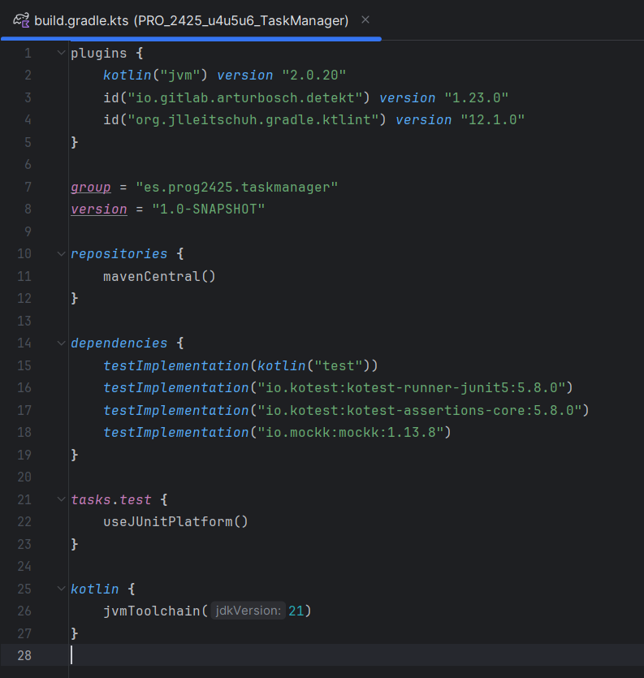
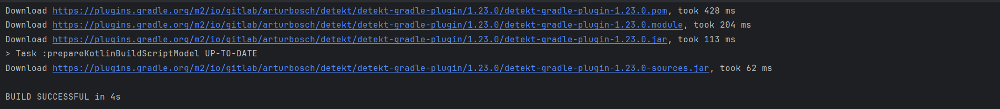
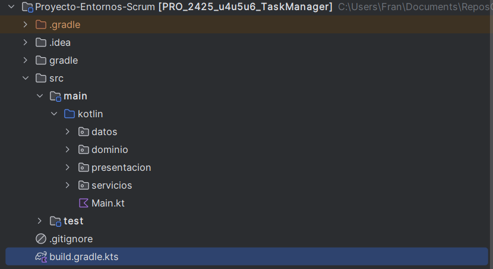

# EDES-4.3.1 - Análisis Estático de Código con Detekt y Ktlint

## Descripción de la Actividad

Esta actividad consiste en instalar y usar un analizador de código estático en el proyecto actual (Detekt o Ktlint), capturar evidencias gráficas, detectar y clasificar errores, aplicar soluciones y explorar configuraciones.

---

## Paso 1: Instalación del Analizador de Código

### Herramienta Elegida: Detekt y Ktlint

Ambas herramientas se han integrado en el proyecto para ampliar el análisis estático y la limpieza del código.

### Instalación

**build.gradle.kts:**

```kotlin
plugins {
    kotlin("jvm") version "2.0.20"
    id("io.gitlab.arturbosch.detekt") version "1.23.0"
    id("org.jlleitschuh.gradle.ktlint") version "12.1.0"
}

kotlin {
    jvmToolchain(17)
}
```

### Capturas recomendadas:





---

## Paso 2: Integración y Ejecución del Análisis

### Ejecución

Desde la terminal del proyecto se han ejecutado los comandos:

```bash
./gradlew detekt
./gradlew ktlintCheck
```

### Capturas recomendadas:

* Resultado del análisis Detekt en terminal (muestra de errores).
* Resultado del análisis Ktlint en terminal (muestra de errores).

---

## Paso 3: Identificación y Documentación de Errores

Se han detectado los siguientes errores:

### Error 1: Naming Convention

* **Descripción:** Uso de nombres en minúsculas para clases.
* **Solución:** Cambiar de `class tarea {...}` a `class Tarea {...}`.
* **Enlaces:**

  * Antes: \[commit link]
  * Después: \[commit link]

### Error 2: Long Method

* **Descripción:** Método con demasiadas líneas.
* **Solución:** Extraer funciones auxiliares.
* **Enlaces:**

  * Antes: \[commit link]
  * Después: \[commit link]

### Error 3: Unused Import

* **Descripción:** Importaciones no utilizadas.
* **Solución:** Eliminar las líneas marcadas.
* **Enlaces:**

  * Antes: \[commit link]
  * Después: \[commit link]

### Error 4: Missing KDoc

* **Descripción:** Falta de documentación en clases públicas.
* **Solución:** Añadir comentarios de documentación.
* **Enlaces:**

  * Antes: \[commit link]
  * Después: \[commit link]

### Error 5: Magic Numbers

* **Descripción:** Uso de números "mágicos" sin constantes.
* **Solución:** Declarar constantes con nombre descriptivo.
* **Enlaces:**

  * Antes: \[commit link]
  * Después: \[commit link]

### Capturas recomendadas:

* Informe de errores Detekt.
* Código antes y después de aplicar soluciones (puedes mostrarlo en VSCode o IntelliJ con los cambios marcados).

---

## Paso 4: Exploración de Configuraciones

### Opción modificada: `maxLineLength`

* Se ha cambiado de 120 a 80 caracteres.

```yaml
style:
  MaxLineLength:
    active: true
    maxLineLength: 80
```

### Impacto:

Obliga a reformatear código largo en varias líneas, mejorando la legibilidad.

### Enlaces:

* Antes del cambio: \[commit link]
* Después del cambio: \[commit link]

### Capturas recomendadas:

* Fragmento de archivo `detekt-config.yml` con el cambio.
* Código afectado antes y después del cambio.

---

## Paso 5: Respuestas a las Preguntas

### \[1]

**1.a** He usado Detekt y Ktlint. Sirven para analizar estáticamente el código Kotlin y asegurar buenas prácticas.
**1.b** Revisión de estilo, convenciones de nombres, estructura, comentarios, etc.
**1.c** Beneficios: código más limpio, mantenible y menos propenso a errores.

### \[2]

**2.a** El que más ha mejorado mi código ha sido extraer funciones largas.
**2.b** Sí, me ha parecido lógico y ha facilitado la comprensión.
**2.c** Se produce por acumulación de lógica sin modularizar.

### \[3]

**3.a** Se puede configurar el estilo, longitud de línea, comentarios obligatorios, nombres, etc.
**3.b** He configurado `maxLineLength`.
**3.c** Enlace antes: \[link], enlace después: \[link]. El código es ahora más legible.

### \[4]

Estas herramientas ayudan a mantener el código profesional, homogéneo y preparado para trabajar en equipo o escalar el proyecto.

---

## Paso 6: Conclusiones y Entrega

### Conclusiones

* El uso de analizadores estáticos es muy útil y me ha hecho detectar errores invisibles a simple vista.
* Además, me ha obligado a aplicar buenas prácticas que mejoran la calidad del proyecto.

### Entrega

* URL del repositorio: \[enlace al repo]
* Rama específica: `analisis-codigo`
* Archivo: `EDES-4.3.1-FR.md` (este documento)

---
