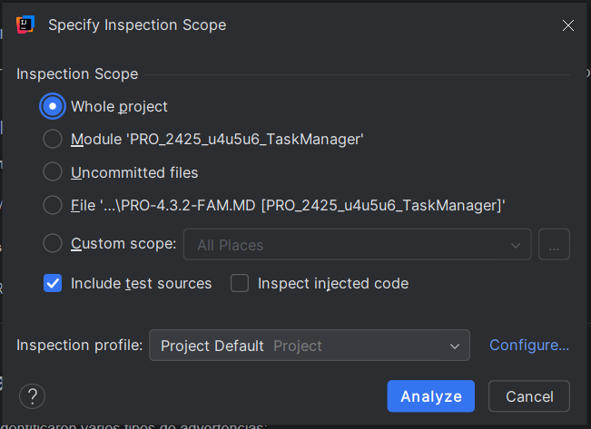
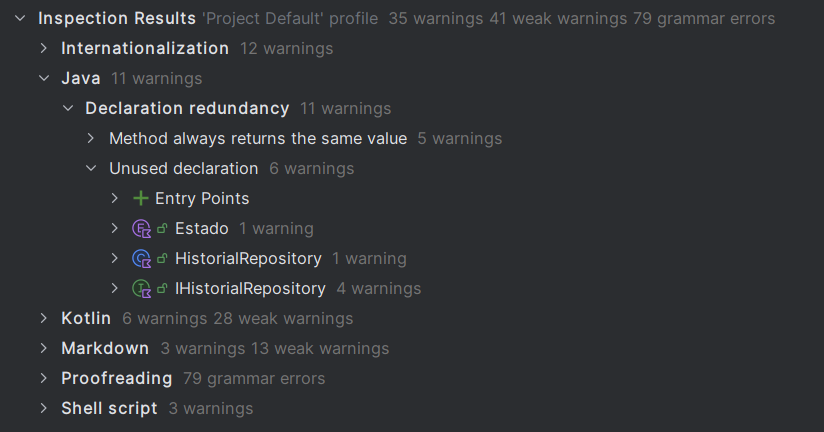
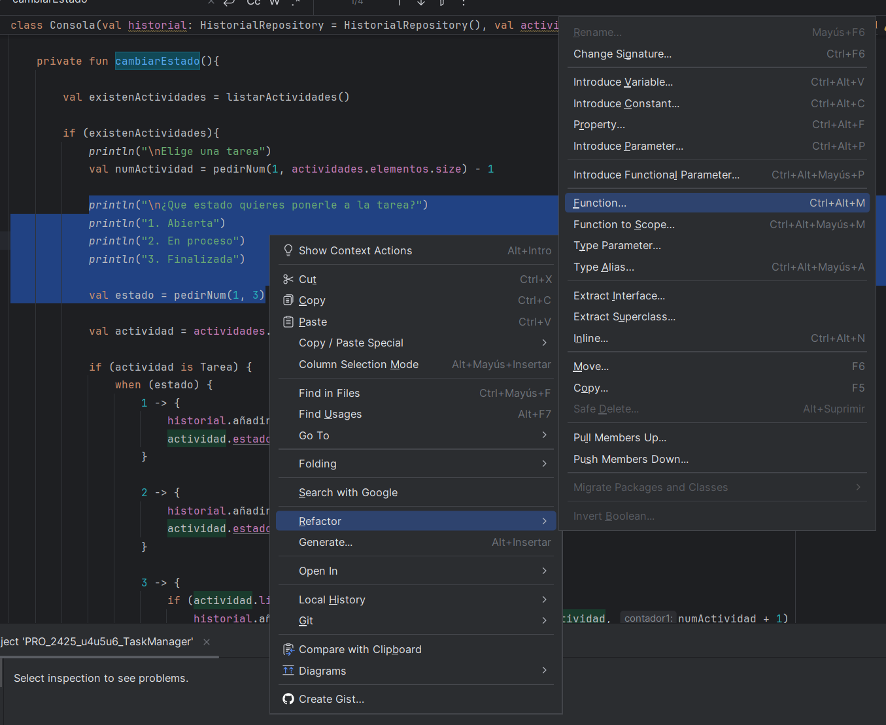
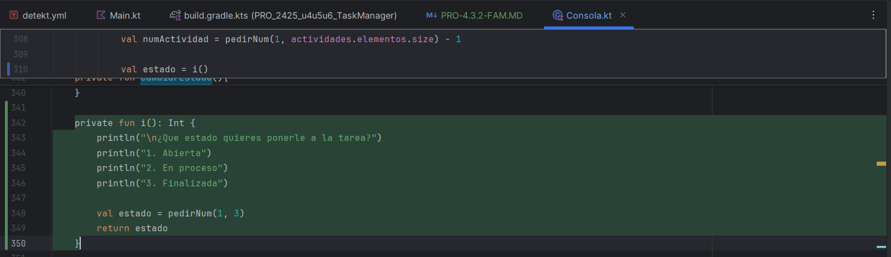

# EDES-P4.3.2

**Actividad:** Aplicación de Code Smells y Patrones de Refactorización en el Código del Task Manager.
**Alumno:** Francisco Alba Muñiz
**ID Actividad:** 4.3.2
**Proyecto:** TaskManager  
**Rama usada:** `4.3.2-FAM`  

## Descripción de la Actividad

Esta actividad consiste en utilizar el análisis de código integrado en IntelliJ IDEA para localizar errores, problemas de estilo y sugerencias de mejora, además de aplicar correcciones y justificar los cambios.

---

## 1: Análisis de Código

### Herramienta Usada: IntelliJ IDEA

Se ha utilizado la función “Analyze > Inspect Code…” para realizar un escaneo completo del proyecto.

#### Análisis del Código con “Inspect Code…”

Se ha realizado un análisis completo del proyecto mediante la herramienta **Analyze > Inspect Code…** de IntelliJ IDEA. Este análisis ha permitido identificar advertencias, errores de estilo y problemas potenciales en diferentes partes del código.

A continuación, se detallan los principales resultados obtenidos:

- **Total de advertencias:** 35
- **Advertencias leves (weak warnings):** 41
- **Errores gramaticales:** 79

**Categorías más destacadas:**

- **Internationalization:** 12 advertencias por caracteres no ASCII.
- **Java:** 11 advertencias, principalmente por declaraciones redundantes.
- **Kotlin:**
    - 6 advertencias por convenciones de nombres.
    - 5 advertencias por construcciones redundantes.
    - 1 posible bug detectado.
- **Markdown:** Problemas en el formato de tablas y numeración de listas.
- **Proofreading:** 79 errores gramaticales en ficheros `.md` (como `README.md`, `Debug.md`, etc).
- **Shell script:** 3 advertencias detectadas con ShellCheck en el script `gradlew`.

Este análisis ha sido útil para localizar puntos de mejora tanto en el código fuente como en la documentación del proyecto.

### Capturas realizadas:

**Menú de análisis de código en IntelliJ:**



**Resultado del análisis con sugerencias detectadas:**



---

## 2: Revisión de Problemas

Tras realizar el escaneo con la herramienta “Inspect Code…”, se detectaron los siguientes tipos de problemas:

- **Caracteres no ASCII:** presentes en múltiples clases, lo que puede afectar a la internacionalización.
- **Redundancias en el código Java y Kotlin:** como declaraciones innecesarias y métodos que siempre devuelven el mismo valor.
- **Construcciones no idiomáticas en Kotlin:** expresiones que pueden reescribirse para mejorar la claridad o el rendimiento.
- **Problemas de estilo y convenciones de nombres:** especialmente en clases y funciones de Kotlin.
- **Errores en documentación Markdown:** como listas mal numeradas o tablas mal formateadas.
- **Errores gramaticales:** en archivos `.md`, lo que puede afectar la presentación del proyecto.
- **Advertencias en scripts Shell:** como variables no utilizadas y uso incorrecto de comandos POSIX.

Esta revisión ha permitido identificar áreas claras de mejora tanto en el código como en la documentación.

---

## 3: Aplicación de Refactorizaciones

Durante el desarrollo de la clase `Consola`, he identificado varias oportunidades para mejorar la legibilidad, reutilización de código y mantener bajo el nivel de complejidad. A continuación, describo tres refactorizaciones que he aplicado usando las herramientas del IDE (Refactor > …).

---

### Refactorización 1: Extracción de Método en `cambiarEstado` y `cambiarEstadoSubTarea`

**Problema:**  
Ambos métodos repetían la lógica para leer el nuevo estado de una tarea, rompiendo el principio DRY y dificultando el mantenimiento.

**Solución:**  
Extraer la lógica de lectura a un método `leerEstado()` que centraliza la entrada y mejora la claridad.

**Ubicación:**  
`Consola.kt`, líneas ~320 y ~350

**Código antes:**  

```kotlin
private fun cambiarEstado(){
    // [...]
    println("\n¿Que estado quieres ponerle a la Subtarea?")
    println("1. Abierta")
    println("2. En proceso")
    println("3. Finalizada")

    val estado = pedirNum(1, 3)
// lógica para cambiar estado...
}

fun cambiarEstadoSubTarea() {
// [...]
    println("\n¿Que estado quieres ponerle a la Subtarea?")
    println("1. Abierta")
    println("2. En proceso")
    println("3. Finalizada")

    val estado = pedirNum(1, 3)
// lógica para cambiar estado subtarea...
}
```

**Código después:**

```kotlin
fun pedirEstadoComoInt(): Int {
    println("\n¿Qué estado quieres poner?")
    println("1. Abierta")
    println("2. En proceso")
    println("3. Finalizada")

    return pedirNum(1, 3)
}

fun cambiarEstado() {
    val estado = pedirEstadoComoInt()
// lógica para cambiar estado...
}

fun cambiarEstadoSubTarea() {
    val estado = pedirEstadoComoInt()
// lógica para cambiar estado subtarea...
}
```

**Caputuras del creado de la nueva función:**





**Test unitario:**

```kotlin
    @Test
    fun `leerDatosEvento devuelve el objeto correcto con entrada simulada`() {
        // Simular entradas de usuario como si se escribieran en consola
        val input = """
            Descripción de prueba
            2025-05-21
            Ubicación de prueba
            urgente;personal
        """.trimIndent()

        // Sustituir temporalmente System.in
        val originalIn: InputStream = System.`in`
        System.setIn(ByteArrayInputStream(input.toByteArray()))

        val consola = Consola()
        val resultado = consola.leerDatosEvento()

        // Restaurar System.in
        System.setIn(originalIn)

        // Asserts
        assertEquals("Descripción de prueba", resultado.descripcion)
        assertEquals("2025-05-21", resultado.fecha)
        assertEquals("Ubicación de prueba", resultado.ubicacion)
        assertEquals("urgente;personal", resultado.etiquetas)
    }
```

**Commit anterior:**  
Puedes consultar el estado del proyecto antes de la refactorización en [este commit específico](https://github.com/AdrianDiaz24/Proyecto-Entornos-Scrum/tree/9ed398d283572ccb350f58d041806101b908152b).

**Commit nuevo:**  
Los cambios aplicados tras la refactorización están disponibles en [esta rama de trabajo actualizada](https://github.com/AdrianDiaz24/Proyecto-Entornos-Scrum/commits/P4.3.2-FAM/).

---

### **Refactorización 2: Introducir Objeto Parámetro en `crearActividad` para Eventos**

**Problema:**  
La función `crearActividad` maneja directamente múltiples variables dispersas para crear un `Evento` (`descripcion`, `fecha`, `ubicacion`, `etiquetas`), lo que complica la gestión y aumenta el riesgo de errores.

**Solución:**  
Crear un `data class DatosEvento` para agrupar la información y un método `leerDatosEvento()` para construir ese objeto, simplificando la llamada a `Evento.creaEvento`.

**Ubicación:**  
`Consola.kt`, línea 135.

---

**Código antes:**

```kotlin
    fun crearActividad(input: Int){
        when (input){
            1 -> try {
                actividades.agregarElemento(Tarea.creaTarea(pedirInfoTarea("Introduce la descripcion de la tarea: "), etiquetas = pedirInfoTarea("Introduce etiquetas (separadas por ;)")))
            } catch (e: IllegalArgumentException) {
                println("**ERROR** $e")
            }
            2 -> {
                val (descripcion, fecha, ubicacion, etiquetas) = pedirInfoEvento()
                try {
                    actividades.agregarElemento(Evento.creaEvento(descripcion, fecha, ubicacion, etiquetas))
                } catch (e: IllegalArgumentException) {
                    println("**ERROR** $e")
                }
            }
        }
    }
```

---

**Código después:**

```kotlin
    data class DatosEvento(
        val descripcion: String,
        val fecha: String,
        val ubicacion: String,
        val etiquetas: String
    )

    fun leerDatosEvento(): DatosEvento {
        println("Introduce la descripcion del evento:")
        val descripcion = readLine() ?: ""
        println("Introduce la fecha del evento:")
        val fecha = readLine() ?: ""
        println("Introduce la ubicacion del evento:")
        val ubicacion = readLine() ?: ""
        println("Introduce etiquetas (separadas por ;):")
        val etiquetas = readLine() ?: ""
        return DatosEvento(descripcion, fecha, ubicacion, etiquetas)
    }

    fun crearActividad(input: Int){
        when (input){
            1 -> try {
                actividades.agregarElemento(Tarea.creaTarea(pedirInfoTarea("Introduce la descripcion de la tarea: "), etiquetas = pedirInfoTarea("Introduce etiquetas (separadas por ;)")))
            } catch (e: IllegalArgumentException) {
                println("**ERROR** $e")
            }
            2 -> {
                val datosEvento = leerDatosEvento()
                try {
                    actividades.agregarElemento(Evento.creaEvento(datosEvento.descripcion, datosEvento.fecha, datosEvento.ubicacion, datosEvento.etiquetas))
                } catch (e: IllegalArgumentException) {
                    println("**ERROR** $e")
                }
            }
        }
    }
```

**Test unitario:**

```kotlin
@Test
    fun `leerDatosEvento devuelve el objeto correcto con entrada simulada`() {
        // Simular entradas de usuario como si se escribieran en consola
        val input = """
            Descripción de prueba
            2025-05-21
            Ubicación de prueba
            urgente;personal
        """.trimIndent()

        // Sustituir temporalmente System.in
        val originalIn: InputStream = System.`in`
        System.setIn(ByteArrayInputStream(input.toByteArray()))

        val consola = Consola()
        val resultado = consola.leerDatosEvento()

        // Restaurar System.in
        System.setIn(originalIn)

        // Asserts
        assertEquals("Descripción de prueba", resultado.descripcion)
        assertEquals("2025-05-21", resultado.fecha)
        assertEquals("Ubicación de prueba", resultado.ubicacion)
        assertEquals("urgente;personal", resultado.etiquetas)
    }
```

**Commit anterior:**  
Puedes consultar el estado del proyecto antes de la refactorización en [este commit específico](https://github.com/AdrianDiaz24/Proyecto-Entornos-Scrum/tree/9ed398d283572ccb350f58d041806101b908152b).

**Commit nuevo:**  
Los cambios aplicados tras la refactorización están disponibles en [esta rama de trabajo actualizada](https://github.com/AdrianDiaz24/Proyecto-Entornos-Scrum/commits/P4.3.2-FAM/).

---

### Refactorización 3: Simplificar condicionales en `cambiarEstado()`

**Problema:**  
La función `cambiarEstado()` tenía múltiples condiciones anidadas y repetidas, lo que dificultaba su lectura y mantenimiento.

**Solución:**
- Uso de `return` temprano para evitar anidaciones innecesarias.
- Cálculo previo de la variable `puedeFinalizar` para no repetir la lógica dentro del `when`.
- Simplificación del `when` eliminando condicionales anidadas.
- Extracción de lógica repetida a una función `cambiarAEstado()`.

**Ubicación:**  
`Consola.kt`, línea ~314

**Código antes:**

```kotlin
private fun cambiarEstado(){
  if (!listarActividades()) return

  println("\nElige una tarea")
  val numActividad = pedirNum(1, actividades.elementos.size) - 1
  val actividad = actividades.elementos[numActividad]

  if (actividad !is Tarea) return

  val estado = pedirEstadoComoInt()

  val puedeFinalizar = actividad.listaSubtareas.isEmpty() ||
          actividad.listaSubtareas.all { it.estado == Estado.FINALIZADA }

  when (estado) {
    1 -> {
      historial.añadirModificacionEstado(Estado.ABIERTA, actividad, numActividad + 1)
      actividad.estado = Estado.ABIERTA
    }
    2 -> {
      historial.añadirModificacionEstado(Estado.EN_PROGRESO, actividad, numActividad + 1)
      actividad.estado = Estado.EN_PROGRESO
    }
    3 -> {
      if (puedeFinalizar) {
        historial.añadirModificacionEstado(Estado.FINALIZADA, actividad, numActividad + 1)
        actividad.estado = Estado.FINALIZADA
      } else {
        println("ERROR: Todas las subtareas tienen que estar marcadas como 'FINALIZADA' antes de finalizar la tarea.")
      }
    }
  }
}
```

**Código después:** 

```kotlin
private fun cambiarEstado() {
  if (!listarActividades()) return

  println("\nElige una tarea")
  val numActividad = pedirNum(1, actividades.elementos.size) - 1
  val actividad = actividades.elementos[numActividad] as? Tarea ?: return

  val estado = pedirEstadoComoInt()
  val puedeFinalizar = actividad.listaSubtareas.isEmpty() ||
          actividad.listaSubtareas.all { it.estado == Estado.FINALIZADA }

  when (estado) {
    1 -> cambiarAEstado(actividad, Estado.ABIERTA, numActividad)
    2 -> cambiarAEstado(actividad, Estado.EN_PROGRESO, numActividad)
    3 -> {
      if (puedeFinalizar) {
        cambiarAEstado(actividad, Estado.FINALIZADA, numActividad)
      } else {
        println("ERROR: Todas las subtareas tienen que estar marcadas como 'FINALIZADA' antes de finalizar la tarea.")
      }
    }
  }
}

private fun cambiarAEstado(tarea: Tarea, nuevoEstado: Estado, num: Int) {
  historial.añadirModificacionEstado(nuevoEstado, tarea, num + 1)
  tarea.estado = nuevoEstado
}
```
**Test unitario:**

```kotlin
class ConsolaTest {

    val consola = object : Consola() {
        override fun pedirNum(min: Int, max: Int): Int {
            return 1 // siempre devuelve 1 para seleccionar la primera opción
        }

        override fun listarActividades(): Boolean {
            return true // para que no retorne falso y no salga temprano
        }

        override fun pedirEstadoComoInt(): Int {
            return 1 // devolver estado abierto sin pedir input
        }
    }
  
    @Test
    fun testCambiarEstadoSimple() {
        consola.actividades.elementos.clear()
        consola.actividades.elementos.add(Tarea("Tarea test"))

        consola.cambiarEstado()

        val tarea = consola.actividades.elementos[0] as? Tarea
        val estado = tarea?.estado
        assertEquals(Estado.ABIERTA, estado)
    }
}
```

**Commit anterior:**  
Puedes consultar el estado del proyecto antes de la refactorización en [este commit específico](https://github.com/AdrianDiaz24/Proyecto-Entornos-Scrum/tree/9ed398d283572ccb350f58d041806101b908152b).

**Commit nuevo:**  
Los cambios aplicados tras la refactorización están disponibles en [esta rama de trabajo actualizada](https://github.com/AdrianDiaz24/Proyecto-Entornos-Scrum/commits/P4.3.2-FAM/).

---

### 4. Respuesta a las preguntas

### **1. Code smells y refactorización**

#### **1.a ¿Qué code smell y patrones de refactorización has aplicado?**

- **Código duplicado**: Extracción de método (`Extract Method`) en `pedirEstadoComoInt()` para evitar repetir código en `cambiarEstado()` y `cambiarEstadoSubTarea()`.
- **Métodos complejos**: Simplificación de condicionales con retornos tempranos y extracción de método en `cambiarEstado()`.
- **Primitive Obsession**: Introducción de objeto parámetro (`Introduce Parameter Object`) con la data class `DatosEvento` para simplificar `crearActividad()`.

#### **1.b Teniendo en cuenta aquella funcionalidad que tiene pruebas unitarias, selecciona un patrón de refactorización de los que has aplicado y que están cubiertos por los test unitarios. ¿Por qué mejora o no mejora tu código? Asegúrate de poner enlaces a tu código**

La función `pedirEstadoComoInt()` tiene pruebas unitarias que verifican la correcta lectura del estado. Esto mejora el código porque centraliza la lógica, evita duplicación y facilita el mantenimiento.

- **Código**: función `pedirEstadoComoInt()` en `Consola.kt`
- **Test**: `pedirEstadoComoInt devuelve el número correcto con entrada simulada` en `ConsolaTest.kt`

---

### **2. Asegurar la estabilidad del código refactorizado**

#### **2.a Describe el proceso que sigues para asegurarte que la refactorización no afecta a código que ya tenías desarrollado**

- Ejecuto los tests antes y después de la refactorización para confirmar que no fallan.
- Refactorizo usando herramientas del IDE para evitar errores manuales.
- Añado tests nuevos si es necesario para cubrir mejor la funcionalidad.

---

### **3. Uso de funcionalidades del IDE**

#### **3.a ¿Qué funcionalidad del IDE has usado para aplicar la refactorización seleccionada? Si es necesario, añade capturas de pantalla para identificar la funcionalidad**

Usé las funciones de refactorización del IDE (IntelliJ IDEA):

- `Extract Method` para extraer `pedirEstadoComoInt()`.
- `Introduce Parameter Object` para crear `DatosEvento`.
- Herramientas de renombrado y chequeo seguro de referencias.

---
